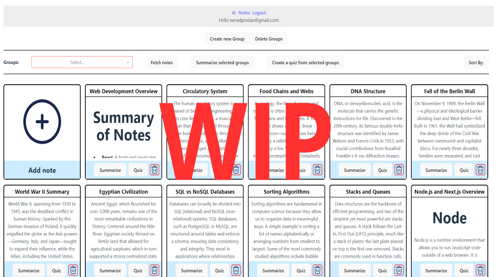
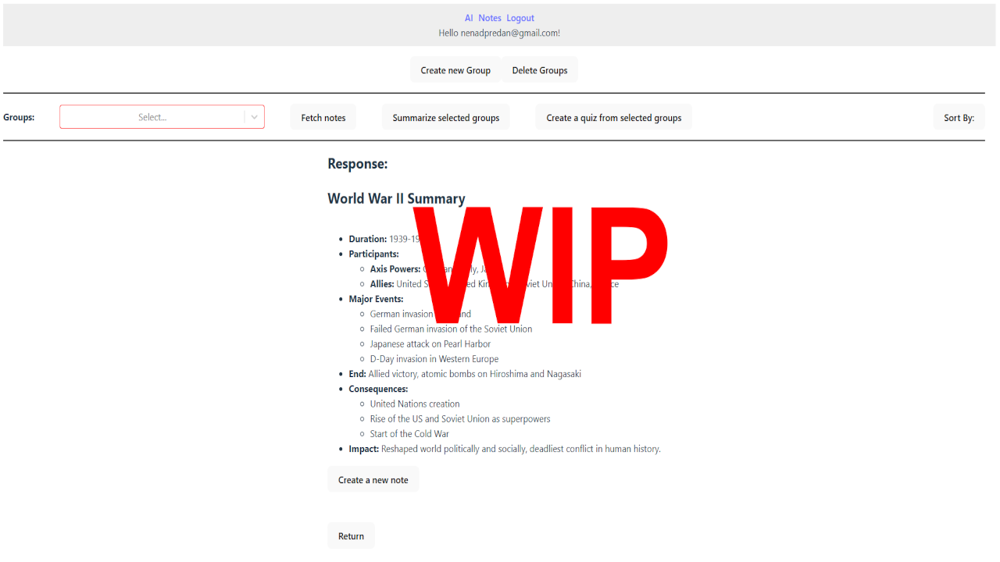

# StudyBuddy - AI powered notes

## 📌 Overview

Studdybuddy is a Chatgpt powered notes manager where you can organise and keep your study notes with the help of AI.
You can use AI to summarzie your notes, make quizzes or ask it questions and make notes out of responses.

## 🛠️ Tech Stack

- Frontend: React
- Backend: Node.js, Express
- Database: PostgreSQL

	
	
	
	

## 🚀 Features

- Create/Edit/Delete Notes
- Sort notes into groups
- AI can summarize a note or group of notes 
- AI can create a quiz based on a note or group of notes
- Ask AI any question and easily create a note ot of the response

## 📸 Screenshots

	
	

## ⭐ Usage

The app is straightforward and simple to use, create notes, manage them and utilise AI powered features to make studying easier.

## 📑 About the Project

I desired to create an app with AI integration and the idea of an AI helping you with studying resonated the most.